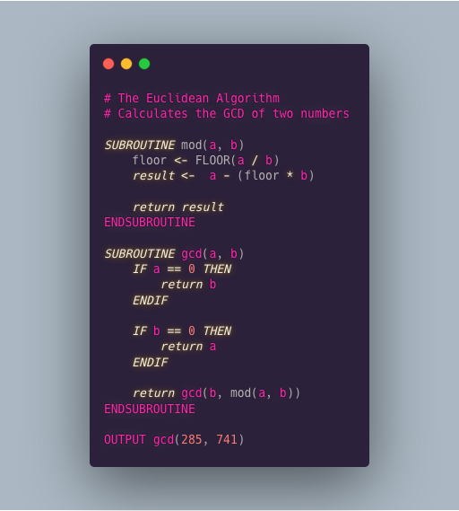

# AQA++
`AQA++` is an **unofficial** implementation of the [AQA psuedocode specification](https://filestore.aqa.org.uk/resources/computing/AQA-8520-TG-PC.PDF) in Go. It also supports some features that aren't in the spec (such as maps) in order to make it slightly more usable, hence the `++` in the name. It is interpreted and the design of the interpreter is based on the one described in the book [Writing An Interpreter in Go](https://interpreterbook.com/).

## Demo
For now, if you want to try it out, you can go to [https://aqa.ollybr.repl.run/](https://aqa.ollybr.repl.run/) for a REPL and [https://repl.it/@ollybr/AQA](https://repl.it/@ollybr/AQA) if you want to write a file. Both of those are just REPL.ITs that download the executable from my website and run it.

## Syntax
### Specification
Everything in the AQA specification except for:
* Constants: `constant a <- 10`
* Some builtin functions/operators, like `MOD` or `DIV`.

*(I'm still planning on adding these)*

### Additions
Additions to the spec (hence to `++`)
* NO UPPERCASE REQUIREMENTS SO THINGS DON'T NEED TO BE SCREAMED
* Use of `0x123edf` syntax to define hexadecimal numbers
* Use of `0b100000` syntax to define binary numbers
* More builtin functions, such as SQRT and FLOOR.
* Bitshifts using `>>` and `<<`

Also, it **WILL* support the following (to be added)
* Maps: using the `{` syntax `}`
* `FN`: similar to a subroutine, but an expression. This means `FN`s will be able to be passed around as arguments.

## Bugs
- [ ] A block for a SUBROUTINE can be ended by a ENDIF and vice versa
- [ ] Idents with numbers do not parse
- [ ] Blocks such as the ones on for/while loops do not create sepearate environments
- [ ] Builtins are not yet tested properly
- [ ] You can currently overwrite builtins like `LEN <- 10`, `LEN([])` makes error `ERROR: not a subroutine, function or builtin: INTEGER`.

Everything not yet in the language but in the spec is also considered a bug.