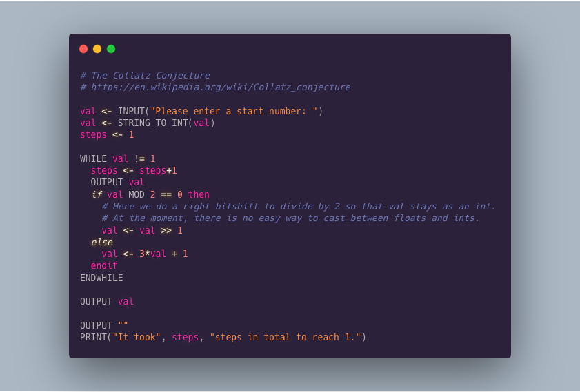

# AQA++

- [AQA++](#aqa)
  - [Demo](#demo)
  - [Syntax](#syntax)
    - [Specification](#specification)
    - [Additions](#additions)
  - [Todo](#todo)


`AQA++` is an **unofficial** implementation of the [AQA psuedocode specification](https://filestore.aqa.org.uk/resources/computing/AQA-8520-TG-PC.PDF) in Go. It also supports some features that aren't in the spec (such as maps) in order to make it slightly more usable, hence the `++` in the name. It is interpreted and the design of the interpreter is based on the one described in the book [Writing An Interpreter in Go](https://interpreterbook.com/).

<p align="center">
  
</p>

## Demo
For now, if you want to try it out, you can go to [https://aqa.ollybr.repl.run/](https://aqa.ollybr.repl.run/) for a REPL and [https://repl.it/@ollybr/AQA](https://repl.it/@ollybr/AQA) if you want to write a file. Both of those are just REPL.ITs that download the executable from my website and run it.

For more examples, see the [_examples folder](_examples/).

## Syntax
### Specification
Everything in the AQA specification. One big difference is that there is no support for special characters at the moment. In the spec, it uses unicode characters such as `←` for assignment and `≥` for greater than or equal. In this version, only the ascii equivalents are supported.

| Specification | Equivalent | Purpose                                   |
|---------------|------------|-------------------------------------------|
| `←`           | `<-`       | Assignment: `a <- 10`                     |
| `≥`           | `>=`       | Greater than or equal: `10 >= 20 # false` |
| `≤`           | `<=`       | Less than or equal: `10 <= 20 # true`     |
| `≠`           | `!=`       | Not equal to: `10 != 20 # true`           |

### Additions
Additions to the spec (hence to `++`)
* Everything doesn't need to be uppercase:
  ```
  a <- STRING_TO_INT("5")
  a <- string_to_int("5")
  ```

* Easily define hexadecimal and binary numbers:
  ```
  hex <- 0x1A4 # 420
  bin <- 0b101010 # 42
  ```

* Many more builtin functions, such as `SQRT`, `FLOOR` and `EXIT`.
  ```
  a <- sqrt(8)
  a - 2*sqrt(2) == 0 # True

  EXIT(1) # Exits the program with 1 as exit code
  ```

* Bitshifts using `>>` and `<<`
  ```
  bin <- 0b0001
  bin << 3 # 0b1000 or 8
  ```

Also, it **WILL** support the following (to be added)
* Maps: using the `{` syntax `}`
  ```
  a <- MAP {
    "hello": true,
    "goodbye": false,
    [1,2]: "foo"
  }
  ```

* Type Coercion
  ```
  fav_num <- 5
  OUTPUT "Your favourite number is: " + fav_num

  # At the moment this produces the error
  # ERROR: type mismatch: STRING + INTEGER

  # It will just work in the future.
  ```

* `FN`: A function definition that is an expression. Like Python's lambda.
  
  See the [map.aqa](_examples/map.aqa) example. `add_5` has to be defined seperately before use. In Python we could do

  ```py
  print( map([1,2,3,4,5], lambda x: x + 5) )
  ```

  This would allow the following;

  ```
  OUTPUT map([1,2,3,4,5], FN(x) { x + 5 } )
  ```

* More meaningful error messages
  ```
  "hello " + 5
  # Current output: "ERROR: type mismatch: STRING + INTEGER"

  "hello " + 5
  # Something like
  # error: addition not supported for `string` and `integer` on line 5:
  #        "hello " + 5
  # did you mean: "hello " + string(5)
  ```

## Todo
- [ ] More tests
- [ ] Better type conversion system
- [ ] Add support for unicode
- [ ] Compile the project to [WebAssembly](https://webassembly.org/) so that it can be run in the browser without [https://repl.it](https://repl.it)
- [ ] Write a wiki/tutorial for the language